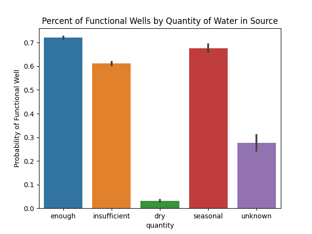
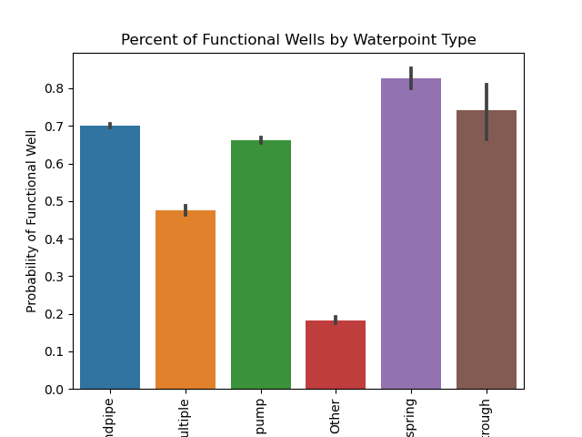
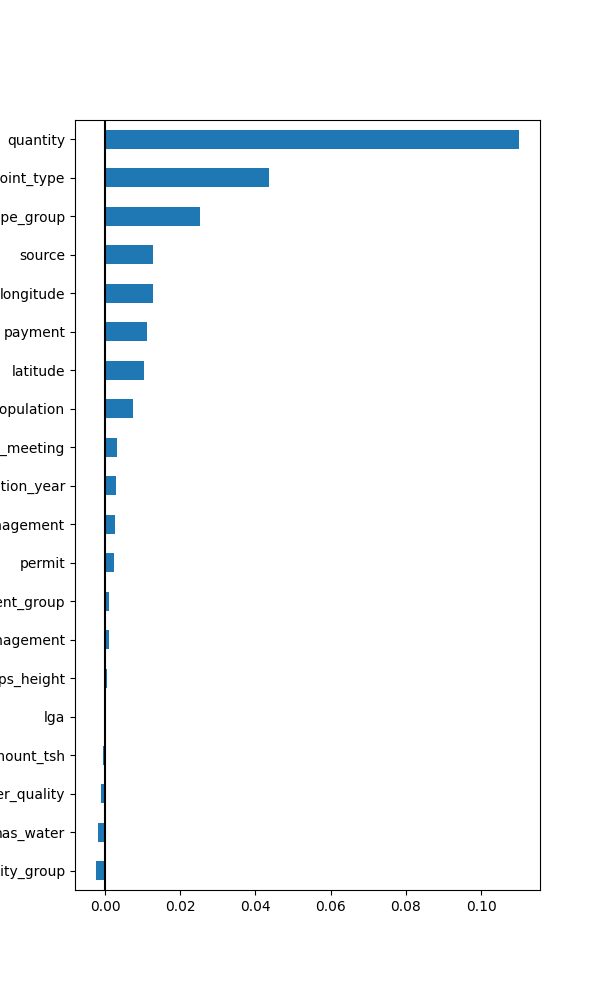

# Pump it Up Well Predictor

## Purpose

This project seeks to predict when wells will fail in Tanzania.  Success in this project would allow repair teams to be deployed more quickly to service these wells.

## Data

The data is drawn from the Pump it Up Well Challenge on Kaggle.  It consists of many columns describing the wells, the locations, the funding sources, and the local governance, as well as the populations of the surrounding area.

The target has 3 classes, Functional, Function needs repair, and non-functional.  We chose to bin together the functional and functional needs repair to make this an easier binary classification and to focus on non-functioning wells as the highest priority for repair.  The Function Needs Repair class was also very difficult for our models to predict, being usually misclassified as Functional.

## EDA

We explored many relationships between features, but here are some interesting ones.

### Water Quantity

As you can see above, the quantity of water in a well is a strong indicator of whether it will function.  Wells with 'enough' water are most likely to be functional, while dry wells (unsurprisingly) tend not to function.  If this is something that we can monitor, and put in sensors in the well, then we should be able to target dry wells for maintenance.

Here you can see that there is some relationships between the type of water source and the functioning of the well.  Unfortunately, the wells at greatest risk are 'other', which is not very informative.  We can see that springs, pumps, and standpipes are often functional.  Troughs are overall often functional, but there is a high confidence interval, meaning we are less certain about this.

## Feature Engineering

We tried many types of feature engineering and feature selection.  However, due to some memory leak issues, not all steps are clearly visible on the notebook.  The most successful strategy, however, was to use PCA to extract the first principal component, or an engineered feature carrying the maximum amount of information that can be combined into one feature, and add that to the original dataset.  

## Feature Selection

We also tried many ways of selecting features.  Of course, our PC was always very important, but we found through permutation importance that a few other features were actually reducing model performance.  After removing those features, our RandomForest model performed at its peak.

## Modeling

We tried and compared a Random Forest model and a deep learning model.  Our Random Forest model handily outclassed the deep learning model, even after tuning.  More importantly, our Random Forest model was quite a bit better at identifying non-functioning wells, which is very important in this problem.

Random Forest test Accuracy: 85%
Random Forest test Recall (non-functioning wells): 77%

Deep Learning test Accuracy: 75%
Deep Learning test Recall (non-functioning wells): 70%

## Final recommendation:

We recommend using the random forest model with features engineered using PCA and chosen according to permutation importance to implement and deploy.  This should help to make the process of pre-emptively maintaining wells in Tanzania more efficient and more timely.  
